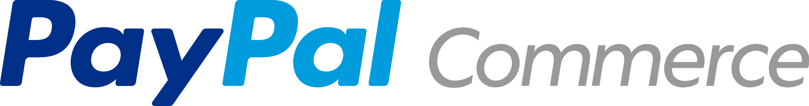
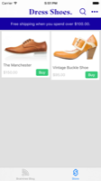
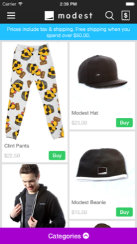

[](https://commerce.paypal.com/)


PayPal Commerce is building a better way to shop on mobile. This means less typing, smarter purchasing, and more flexibility. Powered by Braintree.

[What is PayPal Commerce?](docs/intro.md)

For the basics of getting up & running, read the [Launch Checklist](docs/launch_checklist.md).

Looking for the PayPal iOS SDK to add PayPal payments to your app? You'll want to visit the [PayPal iOS SDK](https://github.com/paypal/PayPal-iOS-SDK) repo.


## Table of Contents    
- [Communication](#communication)
- [Requirements](#requirements)
- [Quick Installation](#quick-installation)
- [Configure the Client](#configure-the-client)
- [Present the Store](#present-the-store)
- [Multiple iOS Apps per Store](#multiple-ios-apps-per-store)
- [More](#more)
- [About PayPal Commerce](docs/about_paypal_commerce.md)


## Communication
- [Sign up to receive emails when we release new versions of the SDK](http://eepurl.com/_c1K9). When a new version is released, we will email you, as well as post a tag in the [Releases section](https://github.com/braintree/paypal-commerce-ios/releases) and update the [CHANGELOG.md](CHANGELOG.md) file.
- For bugs & feature requests, please [file an issue](https://github.com/braintree/paypal-commerce-ios/issues).
- If you need help or have questions, please email [commerce-sdk@getbraintree.com](mailto:commerce-sdk@getbraintree.com).


## Requirements
PayPal Commerce supports iOS 7.0-9.1, which can be run on iPhone 4 & up, iPod Touch 5th gen & up, and iPad 2 & up. We suggest using the latest version of Xcode.


## Quick Installation
We support using CocoaPods to implement the PayPal Commerce SDK in your project. CocoaPods is a dependency manager for Cocoa & Cocoa Touch projects. Information for installing & setting it up in your project is available on [CocoaPods.org](http://cocoapods.org/).

To install the PayPal Commerce SDK using CocoaPods, simply add this to your `Podfile` & run `pod install`:
```
pod 'ModestStoreSDK', :git => 'git@github.com:braintree/paypal-commerce-ios.git'
```

If you don't already use CocoaPods acknowledgements, you'll need to reference [Modest-Acknowledgements.md](ModestStoreSDK/Modest-Acknowledgements.md) somewhere in your app, so proper licensing attribution will be covered.

If you'd like to manage the installation on your own, you can find download links & instructions in our [installation doc](docs/installation.md).


## Configure the Client
#### Create an OAuth Client
Add your app to the [PayPal Commerce Panel](https://commerce.paypal.com/sdk/ios) and copy your `Client ID` & `Secret`. You'll use these to configure the SDK.

#### Add ModestStoreSDK to Your App Delegate
In your app delegate:

```objc
#import <ModestStoreSDK/ModestStoreSDK.h>
```

Use the Client ID & Secret you created above. 

##### You must obfuscate the client id & secret somehow (this protects your store and your customers). 

Within `application:didFinishLaunchingWithOptions:`:

```objc
[ModestStoreSDK configureWithClientID:@"client-id" 
                         clientSecret:@"client-secret" 
                        launchOptions:launchOptions];
```

If you are using a tab bar controller to present the shop to your users, or if you are presenting modally & would like to be notified of transitions, please [implement the `ModestStoreDelegate`](docs/delegate.md).

#### Info.plist Updates
In your app's `Info.plist`, please make the following changes:
- `UIViewControllerBasedStatusBarAppearance` allows us to show & hide the status bar as needed.
- `NSAppTransportSecurity` allows us to securely communicate with Cloudfront & Facebook in iOS 9+. Modest communicates over `https`, but we using loggly.com for internal API logging, which currently require the `forward secrecy` exception. (We expect this to change soon).
- `LSApplicationQueriesSchemes` is needed for Facebook & PayPal to work properly in iOS 9+.
- `UIApplicationShortcutItems` is needed to support 3D Touch from the Home Screen App Icon on iPhone 6s & 6s Plus.

Updates:
```xml
	<key>UIViewControllerBasedStatusBarAppearance</key>
	<false/>
	<key>NSAppTransportSecurity</key>
	<dict>
		<key>NSExceptionDomains</key>
		<dict>
			<key>loggly.com</key>
			<dict>
				<key>NSThirdPartyExceptionRequiresForwardSecrecy</key>
				<false/>
				<key>NSIncludesSubdomains</key>
				<true/>
			</dict>
			<key>facebook.com</key>
			<dict>
				<key>NSIncludesSubdomains</key>
				<true/>
				<key>NSThirdPartyExceptionRequiresForwardSecrecy</key>
				<false/>
			</dict>
			<key>fbcdn.net</key>
			<dict>
				<key>NSIncludesSubdomains</key>
				<true/>
				<key>NSThirdPartyExceptionRequiresForwardSecrecy</key>
				<false/>
			</dict>
			<key>akamaihd.net</key>
			<dict>
				<key>NSIncludesSubdomains</key>
				<true/>
				<key>NSThirdPartyExceptionRequiresForwardSecrecy</key>
				<false/>
			</dict>
		</dict>
	</dict>
	<key>LSApplicationQueriesSchemes</key>
	<array>
		<string>fbapi</string>
		<string>fb-messenger-api</string>
		<string>fbauth2</string>
		<string>fbshareextension</string>
		<string>com.paypal.ppclient.touch.v1</string>
		<string>com.paypal.ppclient.touch.v2</string>
		<string>org-appextension-feature-password-management</string>
	</array>
        <key>UIApplicationShortcutItems</key>
        <array>
            <dict>
                <key>UIApplicationShortcutItemIconType</key>
                <string>UIApplicationShortcutIconTypeHome</string>
                <key>UIApplicationShortcutItemTitle</key>
                <string>Shop</string>
                <key>UIApplicationShortcutItemType</key>
                <string>com.modest.sdk.home</string>
            </dict>
            <dict>
                <key>UIApplicationShortcutItemIconType</key>
                <string>UIApplicationShortcutIconTypeSearch</string>
                <key>UIApplicationShortcutItemTitle</key>
                <string>Search</string>
                <key>UIApplicationShortcutItemType</key>
                <string>com.modest.sdk.search</string>
            </dict>
            <dict>
                <key>UIApplicationShortcutItemIconType</key>
                <string>UIApplicationShortcutIconTypeTime</string>
                <key>UIApplicationShortcutItemTitle</key>
                <string>Purchases</string>
                <key>UIApplicationShortcutItemType</key>
                <string>com.modest.sdk.order-history</string>
            </dict>
        </array>
```

#### Custom URL Scheme for User Login

PayPal Commerce uses a login system that eschews passwords in favor of an email-based login flow. New users will be let in immediately. However, if a returning user attempts to log into your shop, we will send them an email with a login link, and in the app we will display a message requesting they open their email to tap that link, which will have the custom URL scheme that's unique to your app. Tapping the link will open your app, PayPal Commerce will verify their email address, and they will be able to continue shopping.

##### In order for this flow to work properly, please add the custom URL scheme for PayPal Commerce. 

You can get your URL scheme from the [Commerce Panel -> Advanced -> iOS SDK](https://commerce.paypal.com/sdk/ios). Then, add your URL scheme to your project:

1. In `Xcode`, select your Target.
1. Under `URL Types`, add a new type (`+` button).
1. In the `URL Scheme` field, enter the scheme provided by PayPal Commerce (e.g., `pypl-acme-shovels`).

If you are building multiple apps that include the same PayPal Commerce shop, please be sure to [create multiple OAuth clients](#multiple-ios-apps-per-store).

#### URL Handling

And in order for PayPal Commerce to be able to see these URLs, you'll need to add or modify the `application:openURL:…` method in your app delegate:

```objc
- (BOOL)application:(UIApplication *)application openURL:(NSURL *)url sourceApplication:(NSString *)sourceApplication annotation:(id)annotation {
    [ModestStoreSDK openURL:url sourceApplication:sourceApplication annotation:annotation];
    return YES;
}
```

To deep-link to products & categories, please follow our [URL specs docs](docs/url_specs.md).


#### Push Notification Support

For PayPal Commerce to support push notifications for your store, you'll need to add or modify these methods in your app delegate:
```objc
-(void)application:(UIApplication *)application didRegisterForRemoteNotificationsWithDeviceToken:(NSData *)deviceToken{
    [ModestStoreSDK didRegisterForRemoteNotificationsWithDeviceToken:deviceToken];
}
-(void)application:(UIApplication *)application didFailToRegisterForRemoteNotificationsWithError:(NSError *)error{
    [ModestStoreSDK didFailToRegisterForRemoteNotificationsWithError:error];
}
-(void)application:(UIApplication *)application didRegisterUserNotificationSettings:(UIUserNotificationSettings *)notificationSettings{
    [ModestStoreSDK didRegisterUserNotificationSettings:notificationSettings];
}
-(void)application:(UIApplication *)application didReceiveRemoteNotification:(NSDictionary *)userInfo{
    [ModestStoreSDK didReceiveRemoteNotification:userInfo];
}
```

#### iOS 9 Spotlight Search Indexing

In order for products in the end-users' spotlight search to open the app in the correct place, please add this to your App Delegate:
```objc
- (BOOL)application:(UIApplication *)application continueUserActivity:(NSUserActivity *)userActivity restorationHandler:(void(^)(NSArray *restorableObjects))restorationHandler {
    [ModestStoreSDK continueUserActivity:userActivity restorationHandler:restorationHandler];
    return YES;
}
```

#### iPhone 6s/6s Plus 3D Touch

In order for your users to be able to open the app from the Home Screen App Icon's 3D Touch menu, you'll need to add this to your App Delegate:
```objc
-(void)application:(UIApplication *)application performActionForShortcutItem:(nonnull UIApplicationShortcutItem *)shortcutItem completionHandler:(nonnull void (^)(BOOL))completionHandler{
    BOOL didPerformAction = [ModestStoreSDK performActionForShortcutItem:shortcutItem];
    if(!didPerformAction){
        //if you added any custom 3D Touch shortcuts, you can handle them here
    }
    completionHandler(didPerformAction);
}
```

#### Facebook Login

If you'd like to enable Facebook login, please [follow the instructions here](docs/facebook.md).

## Present the Store

There are three types of apps you might be creating. 

#### Modal Presentation
The most popular approach is to present the store modally. Use this method wherever you want the store presented, typically from a button or some other user action.

```objc
[ModestStoreSDK presentModalStore];
```

[](screenshots/modal_shop.gif?raw=true)

#### Tight UI Integration
If you want to integrate the store UI more tightly with your own app, you can use the embedded view controller via:
```objc
UIViewController *mdstVC = [ModestStoreSDK modestRootViewController];
```

One popular approach is to use this in a tab bar:
```objc
tabViewController.viewControllers = @[infoVC, mdstVC, aboutVC];
```

[](screenshots/tab_shop.png?raw=true)

#### Standalone Shop
Finally, if you want *just* the store as an app, without anything else, you can implement this method in your `application:didFinishLaunchingWithOptions:` after you [configure the client](#configure-the-client).

```objc
[ModestStoreSDK presentStoreApp];
```

[](screenshots/products.png?raw=true)


## Multiple iOS Apps per Store
If you are building multiple iOS apps that will interact with one PayPal Commerce store, then you'll need to set up multiple OAuth clients. This is necessary to keep our email verification system functional. In the PayPal Commerce Panel, there's a section called `Advanced`, and under that is `iOS SDK` ([commerce.paypal.com/sdk/ios](https://commerce.paypal.com/sdk/ios)). There you will see your primary OAuth client, as well as a space to add more. Each will provide you with your PayPal Commerce URL scheme, as well as its own client id & secret. Checkout [Configuring the Client](#configure-the-client) for more on where to put those items.


## More
- [Set up initial theming & configuration](docs/config.md)
- [Embed products in your own user interface](docs/product_cards.md)
- [Enable barcode scanning (UPC & QR)](docs/barcode.md)


