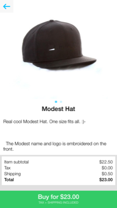

# What is PayPal Commerce?

PayPal Commerce is a mobile retail platform that integrates with your existing ecommerce solution.

The PayPal Commerce iOS SDK allows you embed a store in your existing iOS app or create one as a standalone app, all with minimal code.

The SDK supports three use cases:
- Store as a standalone app.
- Store embedded in your existing app (either modally or more deeply embedded, for example in a tab bar controller).
- Products & buy buttons embedded in your existing app to enable purchasing without leaving the app.

All three are powered by the PayPal Commerce platform. You can manage your stores, credentials, and backends by visiting the [PayPal Commerce Panel](https://commerce.paypal.com/).

Features of the platform:
- Simplified buy flow without the weight of a shopping cart
- Works with your existing ecommerce solution
- Integrated barcode & QR scanning
- Customizable user interface

### Store Purchase Flow

### Example stores
- [Intelligentsia Coffee](https://itunes.apple.com/us/app/intelligentsia-coffee/id404497566?mt=8)
- [Wildflower](https://itunes.apple.com/us/app/wildflower-cases-share-wildflowerlove/id719701540?mt=8)
- [Shawnimals](https://itunes.apple.com/us/app/shawnimals-shop/id842751231?mt=8)

### Support
For bugs & feature requests, please [file an issue](https://github.com/modestinc/modest_sdk_ios/issues).

If you need help or have questions, please email [commerce-sdk@paypal.com](mailto:commerce-sdk@paypal.com).
