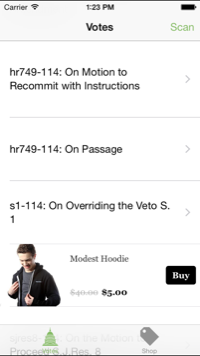
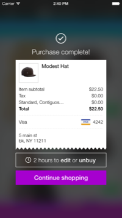
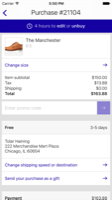
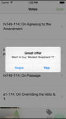

# Embed products in your own user interface

A product card is a simple view that easily allows users to find & buy products within the existing structure of your app. It displays the product name, an image, description, & cost, and includes a buy button that triggers a purchase.  The SDK grabs up-to-date product information from our API, and then populates the view.

## Add a product card to your app

These are views that take a search term as input. To embed a product card into your app:

```objc
CGRect rect = CGRectMake(0, 0, 320, 80);
NSString *searchTerm = @"ninja cats";
MDSTProductCardView *productCardView = [ModestStoreSDK productCardViewWithFrame:rect 
                                                                     searchTerm:searchTerm 
                                                                     completion:^(BOOL success, NSError *error) {

}];
[self.view addSubview:productCardView];
```

Alternatively, if you want to find a product by its group id:
```objc
CGRect rect = CGRectMake(0, 0, 320, 80);
NSString *productGroupID = @""; //use one of your product group ids
MDSTProductCardView *productCardView = [ModestStoreSDK productCardViewWithFrame:rect 
                                                                 productGroupID:productGroupID 
                                                                     completion:^(BOOL success, NSError *error) {

}];
[self.view addSubview:productCardView];
```


### Purchase flow from a product card in a content-based app
You can render a product view within your own app, and allow your users to initiate a purchase.

[](../screenshots/product_card.png?raw=true)
[](../screenshots/purchase_confirmation.png?raw=true)
[](../screenshots/receipt.png?raw=true)


## Display and purchase a product from your app with your own UI
You can also display product information and initiate a purchase using your own UI by fetching a `MDSTProduct` object and executing a purchase on it per some user action.

```objc
[ModestStoreSDK fetchProductWithGroupID:@"" 
                             completion:^(MDSTProduct *product, NSError *error){
        //display something notifying what they're buying
}];
```

Then once the user initiates a purchase, you would call:
```objc
[ModestStoreSDK purchaseProduct:product];
```

### Purchase flow from your own UI in a content-based app
[](../screenshots/purchase_custom_ui.png?raw=true)
[](../screenshots/purchase_confirmation.png?raw=true)
[](../screenshots/receipt.png?raw=true)
